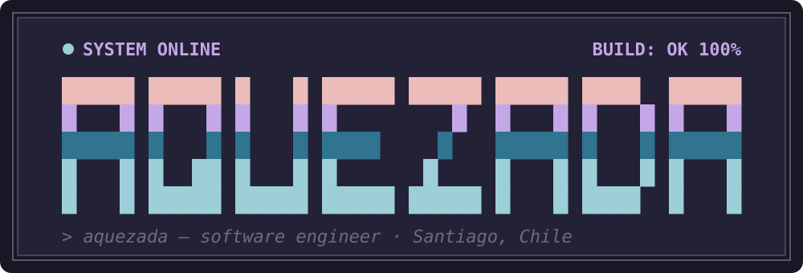

  

📍 Santiago, Chile · 🌐 [aquezada.cl](https://www.aquezada.cl)

- **Ingeniería con IA y agentes**: construyo sistemas multi-agente sobre Claude Code (skills, hooks, subagentes y plugins propios) que llevan un issue de GitHub hasta un PR con tests, code review y verificación automática. Para mí la IA no es un autocompletado: es parte del equipo, con procesos, guardrails y memoria persistente.
- **Backend con Ruby on Rails**: APIs, modelado de dominio y apps que se pueden mantener años.
- **Frontend con React y TypeScript**: interfaces rápidas y cuidadas, con criterio de UI/UX.
- **PHP y WordPress/WooCommerce**: e-commerce real, en producción.
- **Arquitectura**: Clean y Hexagonal, módulos profundos y límites claros.
- **Producto y liderazgo técnico**: roadmap, priorización y decisiones a nivel CTO.

**Stack**

Ruby · Rails · TypeScript · React · PHP · WordPress · WooCommerce · Python · PostgreSQL · Supabase · Claude Code · Neovim
